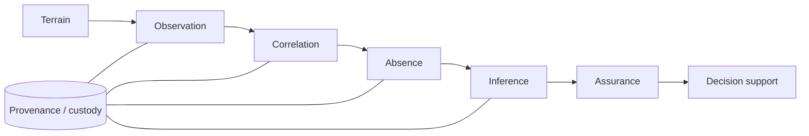

# T.O.C.A.I.A — Intelligence Framework

> **Behavioral OSINT and Detection by Absence**
>
> A research-grade framework for turning *missing expected observations* into auditable intelligence without confusing silence with collection failure.

[Português](README.pt-BR.md) · [Methodology](docs/methodology.md) · [Architecture](docs/architecture.md) · [Research evidence](docs/research-evidence.md) · [Ethics & scope](docs/ethics-and-scope.md) · [OSINT feeds](docs/osint-feeds.md)


## The problem

Most OSINT workflows are optimized for **presence**: find the account, the post, the domain, the relation, the artifact. T.O.C.A.I.A adds a second question:

> **What should have been observable here, under this collection coverage, but was not?**

That distinction matters because an empty result can mean two completely different things:

- `data_gap` → **we did not observe enough to know**;
- `behavioral_gap` → **we observed adequately and the expected event was absent**.

Treating those as the same thing is how analysts manufacture certainty from broken collection.

## The method

**T.O.C.A.I.A** is the workflow. Each stage must produce an artifact that another analyst can inspect.

| Stage | Control question | Required artifact |
|---|---|---|
| **T · Terrain** | What decision, unit of analysis, window and legal/ethical boundary apply? | Scope sheet + collection posture |
| **O · Observation** | What was actually observable, collected, blocked or missed? | Raw evidence register + provenance |
| **C · Correlation** | Are records comparable across time, entities and sources? | Normalized timeline + source map |
| **A · Absence** | Was the expected event detectable, and if so, what is missing? | Gap register (`data_gap` vs `behavioral_gap`) |
| **I · Inference** | Which competing explanations best survive the evidence? | ACH / hypothesis matrix + confidence |
| **A · Assurance** | What would overturn the conclusion, and can another analyst reproduce it? | Adversarial review + revision criteria |



## What makes this different

T.O.C.A.I.A is not another OSINT tool list. Its design centers on analytical controls that are usually scattered across collection, intelligence analysis and digital-evidence practice:

1. **Detectability before interpretation.** A zero is not evidence of absence until coverage is adequate.
2. **Baseline before anomaly.** No declared normal means no defensible deviation.
3. **Competing hypotheses.** The framework prefers refutation over narrative accumulation.
4. **Confidence is explicit.** Evidence strength, analytic confidence and event probability are not collapsed into one number.
5. **Absence has custody.** A gap is timestamped, scoped and preserved like any other analytic artifact.
6. **Passive-by-design.** No active social engineering, messaging, following, credentialed access or interaction with a target is part of the public reference implementation.

## Quick start: synthetic absence analysis

This repository ships a deliberately small reference implementation for the most important control: distinguishing incomplete observation from an observed behavioral gap.

```bash
git clone https://github.com/Ridd1kulusC0d3r/tocaia-osint.git
cd tocaia-osint
python -m pip install -e .
tocaia-analyze examples/synthetic-bx7/weekly.csv
```

Example output:

```text
S06  data_gap        coverage=0.30  expected=34  observed=0
S13  behavioral_gap  coverage=1.00  expected=34  observed=0
S14  behavioral_gap  coverage=1.00  expected=34  observed=0
...
```

The `BX-7` dataset is **synthetic** and exists only to demonstrate the method.

## Research posture: claims are versioned, not marketed

The project keeps a public [claim register](research/claim-register.md) with four states:

- **validated** — supported by a disclosed experiment and appropriate data;
- **synthetic-only** — observed only in simulated data;
- **refuted** — tested and did not survive;
- **unmeasured** — implemented or proposed but not yet measured.

That means negative results stay visible. A framework that hides refutations is branding, not research.

The current working notes report, among other results, that terminal silence duration outperformed a Hawkes-based persistence model in two real-data experiments, while several other components remain synthetic-only or unmeasured. The public repository will only promote those claims as evidence packages become reproducible here. See [Research evidence](docs/research-evidence.md).

## Repository map

```text
.
├── src/tocaia/                 # minimal public reference implementation
├── tests/                      # deterministic unit tests
├── examples/synthetic-bx7/     # synthetic demonstration data only
├── docs/                       # method, architecture, evidence, ethics, feeds
├── feeds/                      # passive OSINT feed lists
├── tools/                      # feedtool.py (stdlib-only feed collector)
├── templates/                  # analyst artifacts for each stage
├── research/                   # claim registry and future experiment packages
├── materials/                  # publication / training release policy
└── .github/workflows/          # CI
```

## Scope and non-goals

This repository is designed for **defensive intelligence, research, training, audit and reproducible analysis of legitimately accessible open-source information**. It is not a stalking kit, doxxing workflow, identity attribution engine, psychological diagnosis system or active-engagement framework.

Public examples must use synthetic or appropriately anonymized data. Real-person investigation material, direct personal contact information and source files marked restricted are not part of the public release.

## Citation

```text
Lourenço, Deivison. T.O.C.A.I.A — Intelligence Framework: Behavioral OSINT and Detection by Absence. 2026.
https://github.com/Ridd1kulusC0d3r/tocaia-osint
```

Machine-readable citation metadata is available in [`CITATION.cff`](CITATION.cff).

## License

- **Code:** MIT, see [`LICENSE`](LICENSE)
- **Framework text, documentation and templates:** CC BY 4.0, see [`LICENSE-DOCS.md`](LICENSE-DOCS.md)

---

**Tocaia is waiting with method.** Observe first. Distinguish collection failure from behavioral absence. Infer last.
