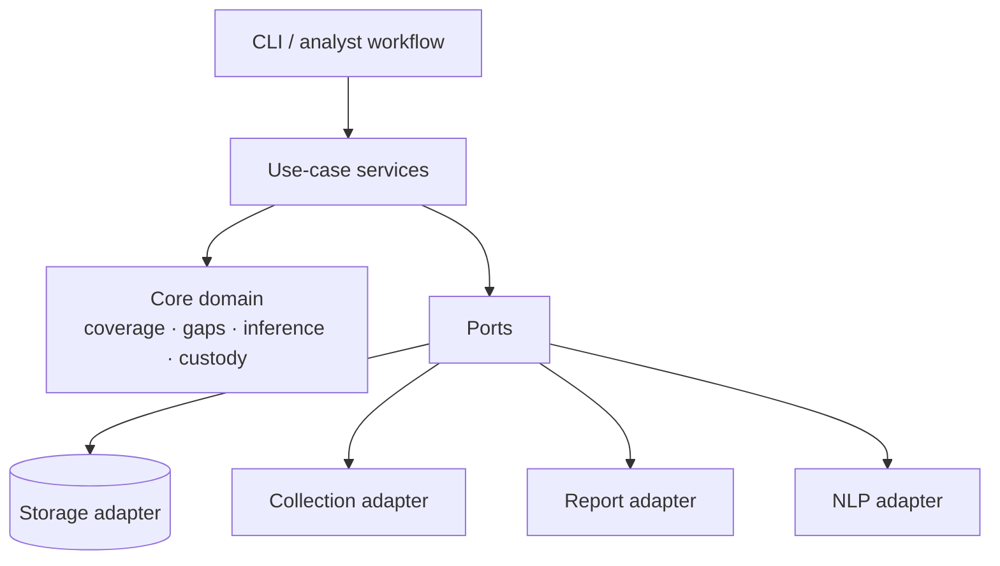

# Architecture

The public repository starts intentionally small. The long-term design is a hexagonal architecture in which the analytical domain stays independent from collection, storage and presentation adapters.

## Public v0.1

The current public code implements only the first invariant worth making executable: **a zero with poor collection coverage is a `data_gap`, not a behavioral finding**.

That is deliberately narrower than the private working architecture described in project notes. The repository should expand only when each new component arrives with tests, evidence and clear scope.

## Target domain model

Future components are expected to preserve these boundaries:

- `core/`: pure domain logic, no network or filesystem I/O;
- `ports/`: interfaces for evidence stores, collectors and reports;
- `adapters/`: SQLite/filesystem, passive collectors, report renderers and optional local NLP;
- `services/`: stage-level use cases;
- `research/`: preregistered experiments that exercise the same core code used by the tool.

## Safety properties

The public architecture should fail closed on capabilities that change the collection posture. In particular, active interaction, credentialed target access and automatic identity/psychological attribution are outside the public reference model.
